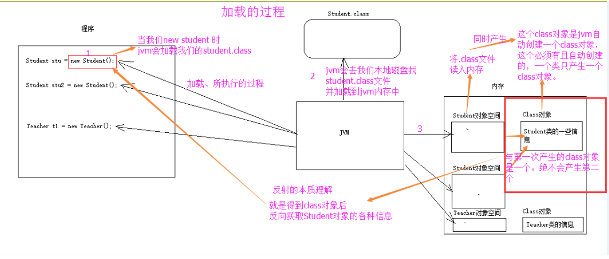

# 反射

**概述：**

- JAVA反射机制是在运行状态中，对于任意一个类，都能够知道这个类的所有属性和方法；对于任意一个对象，都能够调用它的任意一个方法和属性；这种动态获取的信息以及动态调用对象的方法的功能称为java语言的反射机制。
-  Reflection(反射) 是 Java 程序开发语言的特征之一，它允许运行中的 Java 程序对自身进行检查。被private封装的资源只能类内部访问，外部是不行的，但反射能直接操作类私有属性。反射可以在运行时获取一个类的所有信息，（包括成员变量，成员方法，构造器等），并且可以操纵类的字段、方法、构造器等部分
- 要想解剖一个类,必须先要获取到该类的字节码文件对象，解剖使用的就是Class类中的方法.所以先要获取到每一个字节码文件对应的Class类型的对象.

**反射就是把java类中的各种成分映射成一个个的 Java 对象**

一个类有：成员变量、方法、构造方法、包等等信息，利用反射技术可以对一个类进行解剖，把一个个组成部分映射成一个个对象。（其实：一个类中这些成员方法、构造方法、在加入类中都有一个类来描述）

**加载的时候：**Class对象的由来是将 .class 文件读入内存，并为之创建一个Class对象

**Class类：**

- Class 类的实例表示正在运行的 Java 应用程序中的类和接口。也就是jvm中有N多的实例每个类都有该Class对象。（包括基本数据类型）

- Class 没有公共构造方法。Class 对象是在加载类时由 Java 虚拟机以及通过调用类加载器中的 defineClass 方法自动构造的。也就是这不需要我们自己去处理创建，JVM已经帮我们创建好了。

- 我们知道Spring框架可以帮我们创建和管理对象。需要对象时，我们无需自己手动new对象，直接从Spring提供的容器中的Beans获取即可。
- Beans底层其实就是一个Map<String,Object>，最终通过getBean(“user”)来获取。而这其中最核心的实现就是利用反射技术。   
- 在运行期间，一个类，只有一个Class对象产生

**bean：**

- Java面向对象，对象有方法和属性，那么就需要**对象实例来调用方法和属性（即实例化）**
- 凡是有方法或属性的类都需要实例化，这样才能具象化去使用这些方法和属性
- 注册Bean到Spring IoC的注解（**@Component , @Repository , @ Controller , @Service , @Configration**）
- Bean上确实是通过反射、代理来实现的
- 在Spring中，你标识一个@符号，那么Spring就会来看看，并且从这里拿到一个Bean（注册）或者给出一个Bean（使用）

**反射API：**

**获取类对应字节码的对象的三种实现：**

三种方式常用第三种，第一种对象都有了还要反射干什么。第二种需要导入类的包，依赖太强，不导包就抛编译错误

- **对象.getClass()**：调用某个类的对象的getClass()方法

~~~java
Person p = new Person();
Class clazz = p.getClass();
~~~

- **类名.class**：调用类的class属性类获取该类对应的Class对象

~~~java
Class clazz = Person.class;
~~~

- **Class.forName(“类的全路径”)**： 使用Class类中的forName() 静态方法（最安全，性能最好

~~~java
Class clazz = Class.forName("类的全路径");
~~~

**常用方法：**

当我们获得了想要操作的类的Class对象后，可以通过Class类中的方法获取和查看该类中的方法和属性

~~~java
//获取包名、类名
clazz.getPackage().getName()//包名
clazz.getSimpleName()//类名
clazz.getName()//完整类名
 
//获取成员变量定义信息
getFields()//获取所有公开的成员变量,包括继承变量
getDeclaredFields()//获取本类定义的成员变量,包括私有,但不包括继承的变量
getField(变量名)
getDeclaredField(变量名)
 
//获取构造方法定义信息
getConstructor(参数类型列表)//获取公开的构造方法
getConstructors()//获取所有的公开的构造方法
getDeclaredConstructors()//获取所有的构造方法,包括私有
getDeclaredConstructor(int.class,String.class)
 
//获取方法定义信息
getMethods()//获取所有可见的方法,包括继承的方法
getMethod(方法名,参数类型列表)
getDeclaredMethods()//获取本类定义的的方法,包括私有,不包括继承的方法
getDeclaredMethod(方法名,int.class,String.class)
 
//反射新建实例
clazz.newInstance();//执行无参构造创建对象
clazz.newInstance(222,"韦小宝");//执行有参构造创建对象
clazz.getConstructor(int.class,String.class)//获取构造方法
 
//反射调用成员变量
clazz.getDeclaredField(变量名);//获取变量
clazz.setAccessible(true);//使私有成员允许访问
f.set(实例,值);//为指定实例的变量赋值,静态变量,第一参数给null
f.get(实例);//访问指定实例变量的值,静态变量,第一参数给null
 
//反射调用成员方法
Method m = Clazz.getDeclaredMethod(方法名,参数类型列表);
m.setAccessible(true);//使私有方法允许被调用
m.invoke(实例,参数数据);//让指定实例来执行该方法
~~~

**反射的应用：**

~~~java
/*本类用于复习反射的物料类
包: com.reflection
setter,getter,构造方法...
*/
public class Student {
    private String name;
    public int age;
    public String getName() {
        return name;
    }
    public void setName(String name) {
        this.name = name;
    }
 
    public Student(){}
    public Student(String name, int age) {
        this.name = name;
        this.age = age;

    public void play(){
        System.out.println("不玩游戏，学Java！");
    }
    public void sunDay(int n){
        System.out.println("卷起来，没有假！");
    }

}

// 获取类对象
/*本类用于反射的测试*/
public class TestReflect {
    @Test
    public void getClazz() throws ClassNotFoundException {
        //练习获取字节码对象的3种方式
        Class<?> clazz1 = Class.forName("com.review.Student");
        Class<?> clazz2 = Student.class;
        Class<?> clazz3 = new Student().getClass();
 
        //打印的是Student类对应的字节码对象
        System.out.println(clazz1);//class com.reflection.Student
        //获取Student类对应的字节码对象clazz1的名字
        System.out.println(clazz1.getName());//com.reflection.Student
        //通过Student类对应的字节码对象，获取Student类的类名
        System.out.println(clazz1.getSimpleName());
        //通过Student类对应的字节码对象，获取Student类对应的包对象
        System.out.println(clazz1.getPackage());
        //通过Student类对应的字节码对象，先获取Student类对应的包对象，再获取这个包对象的名字
        System.out.println(clazz1.getPackage().getName());
    }
}

// 获取成员变量
/**本类用来测试反射*/
public class TestReflect {
    @Test
    public void getFie() throws ClassNotFoundException {
        //获取Student类对应的字节码对象
        Class<?> clazz = Class.forName("com.review.Student");
        //通过Student类对应的字节码对象获取Student类中的成员变量们
        Field[] fs = clazz.getFields();
        //遍历数组，获取Student类中的每个成员变量的具体信息
        /*注意！目前成员变量的修饰符必须是public的才能获取到*/
        for(Field f : fs){
            System.out.println(f.getName());//通过本轮循环到的字段对象获取字段名
            System.out.println(f.getType());//通过本轮循环到的字段对象获取字段的类型
        }
        
        //通过字节码对象获取目标类Student的构造方法们
        Constructor<?>[] cs = clazz.getConstructors();
        //通过高效for循环遍历数组
        for(Constructor c : cs){
            System.out.println(c.getName());//打印构造方法的名字
            Class[] pt = c.getParameterTypes();//通过构造函数对象获取构造函数的参数类型
            System.out.println(Arrays.toString(pt));//打印参数类型
        }
        
        // 通过反射技术创建目标类的对象,注意抛出异
        Object o = clazz.newInstance(); // 无参构造
        System.out.println(o);//这一步已经获取到了对象Student{name='null', age=0}
        // 全参构造
        Constructor<?> c = clazz.getConstructor(String.class, int.class); //获取目标类中指定的全参构造
 	    Object o2 = c.newInstance("赵六", 6)     //通过获取到的构造函数：创建对象 + 给对象的属性赋值
 
    }
}
~~~

# 动态代理

**为什么需要代理：**

一个歌手，它表演的时候只希望专心唱歌跳舞，但是事实上，唱歌前，跳舞前需要准备场地

~~~java
//BigStar类：
public class BigStar implements star{
    private String name ;

    public String getName() {
        return name;
    }

    public void setName(String name) {
        this.name = name;
    }

    public BigStar(String name) {
        this.name = name;
    }
// 只希望专心唱歌跳舞
    @Override
    public void sing() {
        System.out.println(this.name+"sing...");
    }

    @Override
    public void dance() {
        System.out.println(this.name+"dance...");
    }
}
~~~

此时就需要代理，将表演前准备做好：

~~~java
readySing(){
 System.out.println("唱歌前准备场地")
 //找歌手唱歌
}
readyDance(){
 System.out.println("跳舞前准备场地")
 //找歌手跳舞 
}
~~~

代理公司有有歌手的代理，有厨师的代理，那么顾客怎么知道哪个代理能做什么呢，此时规定，代理需要实现第三方接口，第三方接口里的方法就是代理的方法

即：我们要在接口中写出需要代理的方法

~~~
//接口star：
public interface star {
    void sing() ;
    void dance() ;
}
~~~

- 对象如果嫌身上干的事情太多的话，可以通过代理转移部分内容
- 对象有什么方法想被代理，代理就一定要有对应对象的方法
- 要在接口中定义需要被代理的方法

~~~java
public class ProxyUtil {
    // 为歌手创建代理对象并返回
    public static star createProxy(BigStar bigStar) {
        //参数1： 当前类的类加载器
        //参数2：指定生成的代理长什么样子，也就是有那些方法
        //参数3：指定代理生成的代理对象要干什么事情
        star starProxy =(star) Proxy.newProxyInstance(ProxyUtil.class.getClassLoader() ,new Class[]{star.class} , new InvocationHandler() {
            @Override
            // 参数1：代理的对象
            // 参数2：要执行的方法
            // 参数3：方法的参数
            public Object invoke(Object proxy, Method method, Object[] args) throws Throwable {
                // 指定代理对象要做的事情
                if (method.getName().equals("sing")) {
                    System.out.println("代理唱歌准备场地"); // 代理唱歌准备场地
                } else if (method.getName().equals("dance")) {
                    System.out.println("代理跳舞准备场地"); // 代理唱歌准备场地
                }

                    return method.invoke(bigStar,args) ; //歌手执行方法
            }
        });
        return starProxy ;
    }
}
~~~

Test：

~~~java
public class ProxyTest {
    public static void main(String[] args) {
        // 歌手
        BigStar singer = new BigStar("邓紫棋") ;
        // 通过代理找歌手
        star starProxy = ProxyUtil.createProxy(singer) ;
        starProxy.sing(); 
        //代理唱歌准备场地
		//邓紫棋sing...

    }
}
~~~

# 文件操作

## 基本文件操作

**File类：**

- File 类的对象可以表示一个文件 或者 目录

- 当创建了 File 对象之后，我们可以利用该对象来对文件或者目录进行书属性修改

- File 类的对象 还不能直接对文件进行读写操作，只能修改文件的属性

  ~~~java
  File f=new File("1.txt") //在当前目录下新建文件
  File f=new File("entry") //在当前目录下新建目录
  File f=new File("src\\aa.txt");//相对路径，如果没有前面的src，就在当前目录创建文件
  f.exists() // f1.exists() 文件是否存在
  f.createNewFile(); // 新建文件
  f.getPath() //文件的路径
  f.getAbsolutePath() // 文件的绝对路径
  f.isDirectory() // 当前File实例对象是否为目录
  f.length() // 文件大小
  f.delete() // 删除文件
  ~~~

**字节流：**

流是指一连串流动的数据信号，通过FiFO(先进先出) 的方式接收和发送数据

- 数据流又分为输入流和输出流
- 输入输出流又分为字节流和字符流
- **字节流**：以字节为基本单位 , 在 java.io包中，大部分操作继承**InputStream**（输入字节流）类和**OutputStream**（输出字节流）类
- **字符流**：两个字节为基本单位，专门处理字符串和文本，对于字符流进行操作的类主要是**Reader**（读取流）类和 **Writer**（写入流）类

**FileInputStream类**：

- 继承于InputStream类，这是一个文件输入流，进行文件读操作的最基本的类
- 作用是将文件中的数据输入到内存中，我们可以用它来读文件操作
- 由于字节流的缘故，因此无法读取中文字符

~~~java

		try {
			File file=new File("src\\aa.txt");
			FileInputStream f1=new FileInputStream(file);//新建字节流对象，这里需要进行抛出异常处理
			for (int i = 0; i < file.length(); i++) {
				char ch=(char)(f1.read());//循环读取字符
				System.out.print(ch+" ");
			}
			System.out.println();//换行操作
			f1.close();//关闭文件
		} catch (Exception e) {
			// TODO: handle exception
			System.out.println("文件打开失败");
		}
~~~

**FileOutputStream类**

- FileOutputStream类称为文件输出流，继承于OutputStream类，是文件的基本读写的一个类
- 将内存中的数据输出到文件中，所以我们可以用这个类来进行写文件的操作
- FileInputStream类 和 FileOutputStream类总是成对出现的，一个用作输入流，另一个自然是输出流
- 我们在输入流中使用 byte（字节）数组 来存储我们的数据，因此我们不必考虑数据格式，所以说这两种操作的效率会比较高

~~~java

		File file=new File("src\\aa.txt");
		FileOutputStream f1=new FileOutputStream(file);//(file,true)，这里有true的话，代表可以在文件后面追加内容
		String str="I love java";
		byte[] buff=str.getBytes();//将字符串转换为字节数组
		try {
			f1.write(buff);//把字节数组的内容写进去文件
		} catch (Exception e) {
		}finally {
			try {
				f1.close();
			} catch (IOException e) {
				e.printStackTrace();
			}
		}
~~~

**FileWriter类与 BufferedWriter类：**

~~~java
		String[] str= {"哈哈哈哈,","哇哇哇哇哇,","呜呜呜,","嘎嘎嘎嘎嘎,"};
		File file=new File("src\\cc.txt");//我们在该类的位置创建一个新文件
		try {
			FileWriter f=new FileWriter("src\\cc.txt");//创建文件写入对象
			BufferedWriter f1=new BufferedWriter(f); // 创建字符流写入对象
			//通过循环遍历上面的String 数组中的元素
			for (int i = 0; i < str.length; i++) {
				f1.write(str[i]);//把String中的字符写入文件
				f1.newLine();//换行操作
				}
		} catch (Exception e) {
			...
		}finally {
			try {
				f1.close(); // 我们应该先关闭输入流，然后再关闭文件
				f.close();
			} catch (Exception e2) {
			}
		}
~~~

**FileReader类 与 BufferedReader类**

~~~java
		File file=new File("src\\cc.txt");
		try {
			FileReader f=new FileReader(file); //文件读取对象
			BufferedReader f1=new BufferedReader(f); //字符流对象
			//循环打印cc文件中的每行数据
			String str=null;
			while((str=f1.readLine())!=null) {
				System.out.println(str);
			}
				
		} catch (Exception e) {
			...
		}finally {
			try {
				f1.close();
				f.close();
			} catch (Exception e2) {
				..
			}
		}
~~~

## 文件过滤

在 File类 中有两个和 listFiles 重载的方法，方法的参数传递的就是过滤器:

**实现FileFilter接口**  

~~~java
	public static void read(File file) {
		File[] fi = file.listFiles(new FileFilter() {	//实现FileFilter接口		
			@Override
			public boolean accept(File pathname) {
				if(pathname.isDirectory()) {
					read(pathname);
				}
				return pathname.isDirectory() || pathname.getPath().toLowerCase().endsWith(".java");
			}
		});
		for(File f:fi) {
			System.out.println(f.getName());				
		}
		}		
	}
~~~

- listFiles方法会对构造器传递过来的目录进行遍历，获取每一个文件或文件夹，然后封装为File对象
- listFiles方法会调用参数传递的过滤器中的accept（）方法
- listFiles方法将遍历得到的每一个File对象，传递给accept()方法中的参数pathname
- accept（）方法接收到pathname的值后，根据用户自行重写的过滤规则，然后进行过滤，当符合过滤规则时，返回true,并把传递过来的File对象保存到File数组中；若不符合过滤规则，则返回false,不会把传递过来的File对象保存到File数组中

**实现FilenameFilter接口**

~~~java
public class test {
    public static void main(String[] args) {
        File file = new File("C:\\Users\\lenovo\\Desktop\\java笔记");
        getAllFile(file);
    }

    private static void getAllFile(File file) {
        //传递过滤对象
        File[] files = file.listFiles(new FilenameFilter() {
            @Override
            public boolean accept(File dir, String name) {
                return new File(dir,name).isDirectory() || name.toLowerCase().endsWith(".java");
            }
        });

        for(File filename :files){
            if(filename.isDirectory()){
                getAllFile(filename);
            }else{
                System.out.println(filename);
            }
        }
    }

}
~~~

