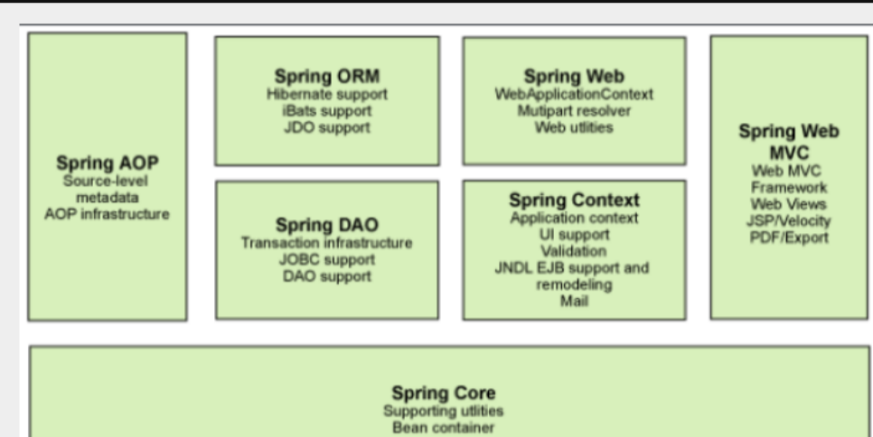
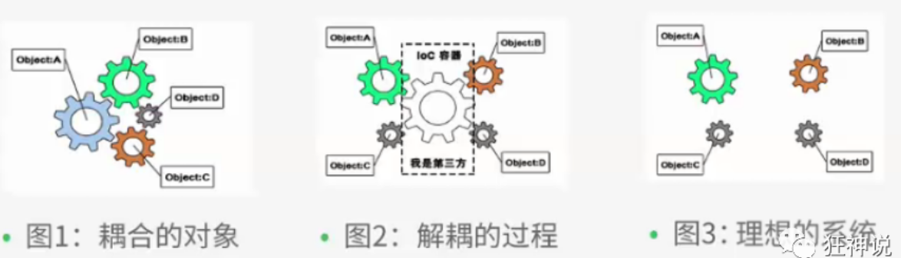
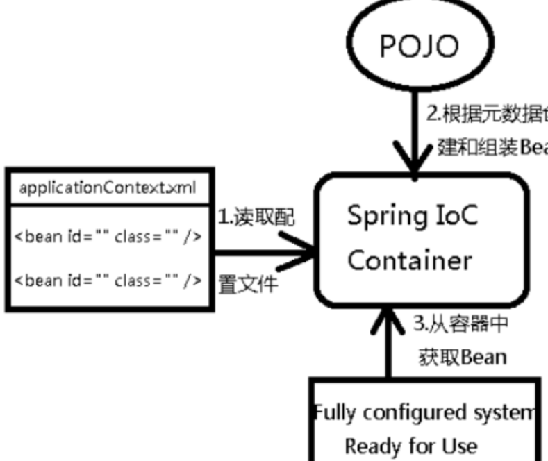
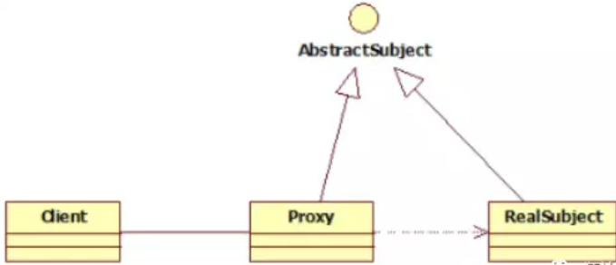
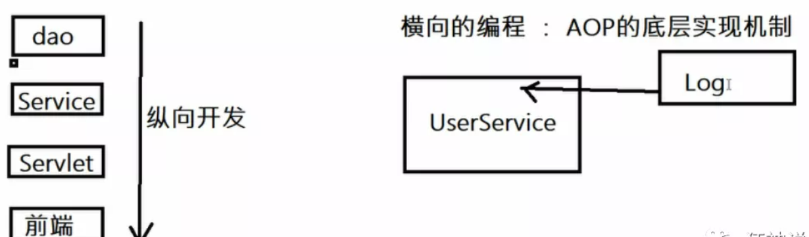
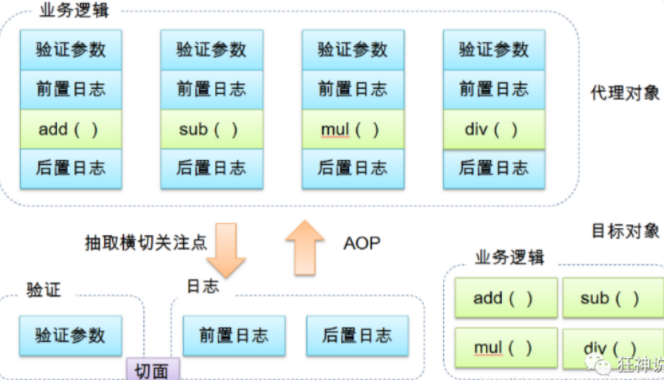

# 概述spring

**spring：**

- **控制反转 IoC , 面向切面 Aop**
- 整合现有的框架技术

**Spring是一个轻量级的控制反转(IoC)和面向切面(AOP)的容器（框架）**

**组成：**

Spring 框架是一个分层架构，由 7 个定义良好的模块组成。Spring 模块构建在核心容器之上，核心容器定义了创建、配置和管理 bean 的方式 .

组成 Spring 框架的每个模块（或组件）都可以单独存在，或者与其他一个或多个模块联合实现

- **核心容器**：核心容器提供 Spring 框架的基本功能。核心容器的主要组件是 **BeanFactory**，它是工厂模式的实现。**BeanFactory 使用*控制反转*（IOC） 模式将应用程序的配置和依赖性规范与实际的应用程序代码分开。**
- **Spring 上下文**：Spring 上下文是一个配置文件，向 Spring 框架提供上下文信息。Spring 上下文包括企业服务，例如 JNDI、EJB、电子邮件、国际化、校验和调度功能。
- **Spring AOP**：通过配置管理特性，**Spring AOP 模块直接将面向切面的编程功能 , 集成到了 Spring 框架中**。所以，可以很容易地使 Spring 框架管理任何支持 AOP的对象。Spring AOP 模块为基于 Spring 的应用程序中的对象提供了事务管理服务。通过使用 Spring AOP，不用依赖组件，就可以将声明性事务管理集成到应用程序中。
- **Spring DAO**：JDBC DAO 抽象层提供了有意义的异常层次结构，可用该结构来管理异常处理和不同数据库供应商抛出的错误消息。异常层次结构简化了错误处理，并且极大地降低了需要编写的异常代码数量（例如打开和关闭连接）。Spring DAO 的面向 JDBC 的异常遵从通用的 DAO 异常层次结构。
- **Spring ORM**：Spring 框架插入了若干个 ORM 框架，从而提供了 ORM 的对象关系工具，其中包括 JDO、Hibernate 和 iBatis SQL Map。所有这些都遵从 Spring 的通用事务和 DAO 异常层次结构。

- **Spring Web 模块**：Web 上下文模块建立在应用程序上下文模块之上，为基于 Web 的应用程序提供了上下文。所以，Spring 框架支持与 Jakarta Struts 的集成。Web 模块还简化了处理多部分请求以及将请求参数绑定到域对象的工作。
- **Spring MVC 框架**：MVC 框架是一个全功能的构建 Web 应用程序的 MVC 实现。通过策略接口，MVC 框架变成为高度可配置的，MVC 容纳了大量视图技术，其中包括 JSP、Velocity、Tiles、iText 和 POI。

**spring 与 boot 与 cloud：**

- Spring Boot 是 Spring 的一套快速配置脚手架，可以基于Spring Boot 快速开发单个微服务;
- Spring Cloud是基于Spring Boot实现的
- Spring Boot专注于快速、方便集成的单个微服务个体，Spring Cloud关注全局的服务治理框架；
- Spring Boot使用了约束优于配置的理念，很多集成方案已经帮你选择好了，能不配置就不配置 , Spring Cloud很大的一部分是基于Spring Boot来实现，Spring Boot可以离开Spring Cloud独立使用开发项目，但是Spring Cloud离不开Spring Boot，属于依赖的关系。
- SpringBoot在SpringClound中起到了承上启下的作用，如果你要学习SpringCloud必须要学习SpringBoot。

# Ioc

## 概述

~~~java
//UserDao接口
public interface UserDao {
   public void getUser();
}

//Dao的实现类
public class UserDaoImpl implements UserDao {
   @Override
   public void getUser() {
       System.out.println("获取用户数据");
  }
}

// UserService的接口
public interface UserService {
   public void getUser();
}

//Service的实现类
public class UserServiceImpl implements UserService {
   private UserDao userDao = new UserDaoImpl();

   @Override
   public void getUser() {
       userDao.getUser();
  }
}

// Test
@Test
public void test(){
   UserService service = new UserServiceImpl();
   service.getUser();
}

// 把Userdao的实现类增加一个 .
public class UserDaoMySqlImpl implements UserDao {
   @Override
   public void getUser() {
       System.out.println("MySql获取用户数据");
  }
}

// 要去使用MySql的话 , 我们就需要去service实现类里面修改对应的实现
public class UserServiceImpl implements UserService {

// 修改此处：UserDaoMySqlImpl()
   private UserDao userDao = new UserDaoMySqlImpl();

   @Override
   public void getUser() {
       userDao.getUser();
  }
}

// 再增加一个Userdao的实现类 .
public class UserDaoOracleImpl implements UserDao {
   @Override
   public void getUser() {
       System.out.println("Oracle获取用户数据");
  }
}
// 要使用Oracle , 又需要去service实现类里面修改对应的实现
~~~

- 我们要使用Oracle , 又需要去service实现类里面修改对应的实现 . 假设我们的这种需求非常大 , 这种方式就根本不适用了, 甚至反人类对吧 , 每次变动 , 都需要修改大量代码 . 这种设计的耦合性太高了, 牵一发而动全身 

**解决**：在需要用到他的地方 , 不去实现它 , 而是留出一个接口 , 利用set 

~~~java
public class UserServiceImpl implements UserService {
   private UserDao userDao;
// 利用set实现
   public void setUserDao(UserDao userDao) {
       this.userDao = userDao;
  }

   @Override
   public void getUser() {
       userDao.getUser();
  }
}

// test
@Test
public void test(){
   UserServiceImpl service = new UserServiceImpl();
   service.setUserDao( new UserDaoMySqlImpl() );
   service.getUser();
   //那我们现在又想用Oracle去实现呢
   service.setUserDao( new UserDaoOracleImpl() );
   service.getUser();
}

~~~

**两者的差别：**

- 前者所有东西都是由程序去进行控制创建
- 后者由我们自行控制创建对象 , 把主动权交给了调用者，程序不用去管怎么创建,怎么实现了. 它只负责提供一个接口 .

这种思想 , 从本质上解决了问题 , 我们程序员**不再去管理对象的创建了 , 更多的去关注业务的实现 . 耦合性大大降低 . 这也就是IOC的原型**

**Ioc的本质：**

**控制反转IoC(Inversion of Control)，是一种设计思想，DI(依赖注入)是实现IoC的一种方法**，也有人认为DI只是IoC的另一种说法。没有IoC的程序中 , 我们使用面向对象编程 , 对象的创建与对象间的依赖关系完全硬编码在程序中，对象的创建由程序自己控制，控制反转后将对象的创建转移给第三方，个人认为所谓控制反转就是：获得依赖对象的方式反转了。

**控制反转是一种通过描述（XML或注解）并通过第三方去生产或获取特定对象的方式。在Spring中实现控制反转的是IoC容器，其实现方法是依赖注入（Dependency Injection,DI）**

- 控制：谁来控制对象的创建 , 传统应用程序的对象是由程序本身控制创建的 , 使用Spring后 , 对象是由Spring来创建的
- 反转： 程序本身不创建对象 , 而变成被动的接收对象 .

**IoC是Spring框架的核心内容**，使用多种方式完美的实现了IoC，可以使用XML配置，也可以使用注解，新版本的Spring也可以零配置实现IoC。

Spring容器在初始化时先读取配置文件，根据配置文件或元数据创建与组织对象存入容器中，程序使用时再从Ioc容器中取出需要的对象。

**bean的配置方式：**

- XML配置：Bean的定义信息是和实现分离的
- 注解配置：Bean的定义信息是和实现合为一体，Bean的定义信息直接以注解的形式定义在实现类中，从而达到了零配置的目的。

bean的配置：

~~~java
<!--设置别名：在获取Bean的时候可以使用别名获取-->
<alias name="userT" alias="userNew"/>

<!--bean就是java对象,由Spring创建和管理-->

<!--
   id 是bean的标识符,要唯一,如果没有配置id,name就是默认标识符
   如果配置id,又配置了name,那么name是别名
   name可以设置多个别名,可以用逗号,分号,空格隔开
   如果不配置id和name,可以根据applicationContext.getBean(.class)获取对象;

class是bean的全限定名=包名+类名
-->
<bean id="hello" name="hello2 h2,h3;h4" class="com.kuang.pojo.Hello">
   <property name="name" value="Spring"/>
</bean>
~~~

## 创建对象/依赖注入的方式

对象由Spring 来创建 , 管理 , 装配 

### 构造方法

通过**无参构造方法**来创建

~~~java
// user类
public class User {

   private String name;

   public User() {
       System.out.println("user无参构造方法");
  }

   public void setName(String name) {
       this.name = name;
  }

   public void show(){
       System.out.println("name="+ name );
  }

}

//beans.xml
<?xml version="1.0" encoding="UTF-8"?>
<beans xmlns="http://www.springframework.org/schema/beans"
      xmlns:xsi="http://www.w3.org/2001/XMLSchema-instance"
      xsi:schemaLocation="http://www.springframework.org/schema/beans
       http://www.springframework.org/schema/beans/spring-beans.xsd">

   <bean id="user" class="com.kuang.pojo.User">
       <property name="name" value="kuangshen"/>
   </bean>

</beans>
       
//test
@Test
public void test(){
   ApplicationContext context = new ClassPathXmlApplicationContext("beans.xml");
   //在执行getBean的时候, user已经创建好了 , 通过无参构造
   User user = (User) context.getBean("user");
   //调用对象的方法 .
   user.show();
}
// 在调用show方法之前，User对象已经通过无参构造初始化了
~~~

**有参构造方法创建：**

三种方式映射参数：

~~~java
<!-- 第一种根据index参数下标设置 -->
<bean id="userT" class="com.kuang.pojo.UserT">
   <!-- index指构造方法 , 下标从0开始 -->
   <constructor-arg index="0" value="kuangshen2"/>
</bean>
<!-- 第二种根据参数名字设置 -->
<bean id="userT" class="com.kuang.pojo.UserT">
   <!-- name指参数名 -->
   <constructor-arg name="name" value="kuangshen2"/>
</bean>
<!-- 第三种根据参数类型设置 -->
<bean id="userT" class="com.kuang.pojo.UserT">
   <constructor-arg type="java.lang.String" value="kuangshen2"/>
</bean>

~~~

### Set方法

 要求被注入的属性 , 必须有set方法 , set方法的方法名由set + 属性首字母大写 , 如果属性是boolean类型 , 没有set方法 , 是 is

实体类准备：

~~~java
 // Address.java
 public class Address {
 
     private String address;
 
     public String getAddress() {
         return address;
    }
 
     public void setAddress(String address) {
         this.address = address;
    }
 }
// studen
 import java.util.List;
 import java.util.Map;
 import java.util.Properties;
 import java.util.Set;
 
 public class Student {
 
     private String name;
     private Address address;
     private String[] books;
     private List<String> hobbys;
     private Map<String,String> card;
     private Set<String> games;
     private String wife;
     private Properties info;
 
     public void setName(String name) {
         this.name = name;
    }
 
     public void setAddress(Address address) {
         this.address = address;
    }
 
     public void setBooks(String[] books) {
         this.books = books;
    }
 
     public void setHobbys(List<String> hobbys) {
         this.hobbys = hobbys;
    }
 
     public void setCard(Map<String, String> card) {
         this.card = card;
    }
 
     public void setGames(Set<String> games) {
         this.games = games;
    }
 
     public void setWife(String wife) {
         this.wife = wife;
    }
 
     public void setInfo(Properties info) {
         this.info = info;
    }
 
     public void show(){
         System.out.println("name="+ name
                 + ",address="+ address.getAddress()
                 + ",books="
        );
         for (String book:books){
             System.out.print("<<"+book+">>\t");
        }
         System.out.println("\n爱好:"+hobbys);
 
         System.out.println("card:"+card);
 
         System.out.println("games:"+games);
 
         System.out.println("wife:"+wife);
 
         System.out.println("info:"+info);
 
    }
 }

~~~

**依赖注入：**

~~~java
 <bean id="addr" class="com.kuang.pojo.Address">
 // 常量注入
     <property name="address" value="重庆"/>
 </bean>
 
 <bean id="student" class="com.kuang.pojo.Student">
 // 常量注入
     <property name="name" value="小明"/>
     // ref:值是一个引用
     <property name="address" ref="addr"/>
     // 数组注入
     <property name="books">
         <array>
             <value>西游记</value>
             <value>红楼梦</value>
             <value>水浒传</value>
         </array>
     </property>
     // List注入
      <property name="hobbys">
     <list>
         <value>听歌</value>
         <value>看电影</value>
         <value>爬山</value>
     </list>
 </property>
 // Map注入
  <property name="card">
     <map>
         <entry key="中国邮政" value="456456456465456"/>
         <entry key="建设" value="1456682255511"/>
     </map>
 </property>
// set注入
 <property name="games">
     <set>
         <value>LOL</value>
         <value>BOB</value>
         <value>COC</value>
     </set>
 </property>
// Null注入
 <property name="wife"><null/></property>
// Properties注入
 <property name="info">
     <props>
         <prop key="学号">20190604</prop>
         <prop key="性别">男</prop>
         <prop key="姓名">小明</prop>
     </props>
 </property>
 </bean>
~~~

**p命名和c命名注入**

~~~java
// 这里没有有参构造器!!
public class User {
     private String name;
     private int age;
 
     public void setName(String name) {
         this.name = name;
    }
 
     public void setAge(int age) {
         this.age = age;
    }
 
     @Override
     public String toString() {
         return "User{" +
                 "name='" + name + '\'' +
                 ", age=" + age +
                 '}';
    }
 }

~~~

- P命名空间注入 : 需要在头文件中加入约束文件

~~~java
 导入约束 : xmlns:p="http://www.springframework.org/schema/p"
 
 <!--P(属性: properties)命名空间 , 直接注入属性-->
 <bean id="user" class="com.kuang.pojo.User" p:name="狂神" p:age="18"/>
~~~

- c 命名空间注入 : 需要在头文件中加入约束文件

~~~java
 导入约束 : xmlns:c="http://www.springframework.org/schema/c"
 <!--C(构造: Constructor)命名空间 , 使用构造器注入-->
 <bean id="user" class="com.kuang.pojo.User" c:name="狂神" c:age="18"/>
~~~

- 此时报错，把有参构造器加上，问题解决 ==> c 就是所谓的构造器注入

## bean 的作用域

在Spring中，那些组成应用程序的主体及由Spring IoC容器所管理的对象，被称之为bean。简单地讲，bean就是由IoC容器初始化、装配及管理的对象

**bean的四大作用域：**

- **Singleton(单例模式)**

当一个bean的作用域为Singleton，那么Spring IoC容器中只会存在一个共享的bean实例，并且所有对bean的请求，只要id与该bean定义相匹配，则只会返回bean的同一实例。Singleton是单例类型，就是**在创建起容器时就同时自动创建了一个bean的对象，不管你是否使用，他都存在了**，**每次获取到的对象都是同一个对象**。注意，Singleton作用域是Spring中的缺省作用域。要在XML中将bean定义成singleton，可以这样配置：

~~~java
 <bean id="ServiceImpl" class="cn.csdn.service.ServiceImpl" scope="singleton">
~~~

- **Prototype（原型模式**

当一个bean的作用域为Prototype，**表示一个bean定义对应多个对象实例**。Prototype作用域的bean会导致**在每次对该bean请求**（将其注入到另一个bean中，或者以程序的方式调用容器的getBean()方法）**时都会创建一个新的bean实例**。Prototype是原型类型，它在我们**创建容器的时候并没有实例化**，而是当我们获取bean的时候才会去创建一个对象，而且我们每次获取到的对象都不是同一个对象。

根据经验，对有状态的bean应该使用prototype作用域，而对无状态的bean则应该使用singleton作用域。在XML中将bean定义成prototype，可以这样配置：

~~~java
 <bean id="account" class="com.foo.DefaultAccount" scope="prototype"/>  
  //或者
 <bean id="account" class="com.foo.DefaultAccount" singleton="false"/>
~~~

- **Request**

当一个bean的作用域为Request，表示**在一次HTTP请求中，一个bean定义对应一个实例**；即每个HTTP请求都会有各自的bean实例，它们依据某个bean定义创建而成。该作用域仅在基于web的Spring ApplicationContext情形下有效。针对每次HTTP请求，Spring容器会根据loginAction bean的定义创建一个全新的LoginAction bean实例，且该**loginAction bean实例仅在当前HTTP request内有效**，因此**可以根据需要放心的更改所建实例的内部状态**，而**其他请求中根据loginAction bean定义创建的实例，将不会看到这些特定于某个请求的状态变化**。当处理请求结束，**request作用域的bean实例将被销毁**

~~~java
 <bean id="loginAction" class=cn.csdn.LoginAction" scope="request"/>
~~~

- **Session**

当一个bean的作用域为Session，**表示在一个HTTP Session中，一个bean定义对应一个实例**。该作用域仅在基于web的Spring ApplicationContext情形下有效。针对某个HTTP Session，Spring容器会根据userPreferences bean定义创建一个全新的userPreferences bean实例，且该userPreferences bean仅在当前HTTP Session内有效。与request作用域一样，可以根据需要放心的更改所创建实例的内部状态，而别的HTTP Session中根据userPreferences创建的实例，将不会看到这些特定于某个HTTP Session的状态变化。当HTTP Session最终被废弃的时候，在该HTTP Session作用域内的bean也会被废弃掉

~~~java
 <bean id="userPreferences" class="com.foo.UserPreferences" scope="session"/>
~~~

## bean 的自动装配（注解

自动装配是使用spring满足bean依赖的一种方法，spring会在应用上下文中为某个bean寻找其依赖的bean。

**Spring中bean的三种装配机制：**

- 在xml中显式配置
- 在java中显式配置
- 隐式的bean发现机制和自动装配

**Spring的自动装配的两个操作：**

- 组件扫描(component scanning)：spring会自动发现应用上下文中所创建的bean；
- 自动装配(autowiring)：spring自动满足bean之间的依赖，也就是我们说的IoC/DI；

手动

~~~java
// 实体类
public class Cat {
   public void shout() {
       System.out.println("miao~");
  }
}
public class Dog {
   public void shout() {
       System.out.println("wang~");
  }
}
public class User {
   private Cat cat;
   private Dog dog;
   private String str;
}
~~~

Spring配置文件

~~~java
<?xml version="1.0" encoding="UTF-8"?>
<beans xmlns="http://www.springframework.org/schema/beans"
      xmlns:xsi="http://www.w3.org/2001/XMLSchema-instance"
      xsi:schemaLocation="http://www.springframework.org/schema/beans
       http://www.springframework.org/schema/beans/spring-beans.xsd">

   <bean id="dog" class="com.kuang.pojo.Dog"/>
   <bean id="cat" class="com.kuang.pojo.Cat"/>

   <bean id="user" class="com.kuang.pojo.User">
       <property name="cat" ref="cat"/>
       <property name="dog" ref="dog"/>
       <property name="str" value="qinjiang"/>
   </bean>
</beans>
~~~

**autowire byName (按名称自动装配)**

将 cat 的bean id修改为 catXXX时，报空指针java.lang.NullPointerException异常，因为按byName规则找不对应set方法，真正的setCat就没执行，对象就没有初始化，所以调用时就会报空指针错误。

**当一个bean节点带有 autowire byName的属性时**：

- 将查找其类中所有的set方法名，例如setCat，获得将set去掉并且首字母小写的字符串，即cat
- 去spring容器中寻找是否有此字符串名称id的对象。
- 如果有，就取出注入；如果没有，就报空指针异常。

**autowire byType (按类型自动装配)**

使用autowire byType首先需要保证：同一类型的对象，在spring容器中唯一。如果不唯一，会报不唯一的异常，NoUniqueBeanDefinitionException。

~~~java
<bean id="dog" class="com.kuang.pojo.Dog"/>
<bean id="cat" class="com.kuang.pojo.Cat"/>
// 在注册一个cat 的bean对象
<bean id="cat2" class="com.kuang.pojo.Cat"/>
// 将user的bean配置修改一下 ： autowire=“byType”
<bean id="user" class="com.kuang.pojo.User" autowire="byType">
   <property name="str" value="qinjiang"/>
</bean>
~~~

报错：NoUniqueBeanDefinitionException

删掉cat2，将cat的bean名称改掉,因为是按类型装配并不会报异常，也不影响最后的结果。甚至将id属性去掉，也不影响结果。

**使用注解自动化装配：**

jdk1.5开始支持注解，spring2.5开始全面支持注解

**开启注解装配的配置：**

- 要引入aop的包

- 在spring配置文件中引入context文件头

~~~java
<?xml version="1.0" encoding="UTF-8"?>
<beans xmlns="http://www.springframework.org/schema/beans"
      xmlns:xsi="http://www.w3.org/2001/XMLSchema-instance"
      xmlns:context="http://www.springframework.org/schema/context"
      xsi:schemaLocation="http://www.springframework.org/schema/beans
       http://www.springframework.org/schema/beans/spring-beans.xsd
       http://www.springframework.org/schema/context
       http://www.springframework.org/schema/context/spring-context.xsd">

</beans>

~~~

- 开启属性注解支持

~~~java
<context:annotation-config/>
~~~

**@Autowired**

- @Autowired是按类型自动转配的，不支持id匹配。
- 需要导入 spring-aop的包！

~~~java
// 将User类中的set方法去掉，使用@Autowired注解
public class User {
   @Autowired
   private Cat cat;
   @Autowired
   private Dog dog;
   private String str;

   public Cat getCat() {
       return cat;
  }
   public Dog getDog() {
       return dog;
  }
   public String getStr() {
       return str;
  }
}

// 此时配置文件内容
<context:annotation-config/>

<bean id="dog" class="com.kuang.pojo.Dog"/>
<bean id="cat" class="com.kuang.pojo.Cat"/>
<bean id="user" class="com.kuang.pojo.User"/>
~~~

**@Autowired(required=boolean)** 

- 如果允许对象为null，设置required = false,默认为true
- @Autowired(required=false) 说明：false，对象可以为null；true，对象必须存对象，不能为null。

**@Qualifier**

- @Autowired是根据类型自动装配的，加上@Qualifier则可以根据byName的方式自动装配
- @Qualifier不能单独使用。

~~~java
<bean id="dog1" class="com.kuang.pojo.Dog"/>
<bean id="dog2" class="com.kuang.pojo.Dog"/>
<bean id="cat1" class="com.kuang.pojo.Cat"/>
<bean id="cat2" class="com.kuang.pojo.Cat"/>
~~~

- 没有加Qualifier测试，直接报错

~~~java
// 在属性上添加Qualifier注解
@Autowired
@Qualifier(value = "cat2")
private Cat cat;
@Autowired
@Qualifier(value = "dog2")
private Dog dog;
~~~

**@Resource**

- @Resource如有指定的name属性，先按该属性进行byName方式查找装配；
- 先进行byName查找，失败；再进行byType查找
- 都不成功，则报异常。

~~~java
public class User {
   //如果允许对象为null，设置required = false,默认为true
   @Resource(name = "cat2")
   private Cat cat;
   @Resource
   private Dog dog;
   private String str;
}

//xml
<bean id="dog" class="com.kuang.pojo.Dog"/>
<bean id="cat1" class="com.kuang.pojo.Cat"/>
<bean id="cat2" class="com.kuang.pojo.Cat"/>

<bean id="user" class="com.kuang.pojo.User"/>
~~~

**@Autowired与@Resource异同：**

- @Autowired与@Resource都可以用来装配bean。都可以写在字段上，或写在setter方法上。
- @Autowired默认按类型装配（属于spring规范），默认情况下必须要求依赖对象必须存在，如果要允许null 值，可以设置它的required属性为false，如：@Autowired(required=false) ，如果我们想使用名称装配可以结合@Qualifier注解进行使用

- @Resource（属于J2EE复返），默认按照名称进行装配，名称可以通过name属性进行指定。如果没有指定name属性，当注解写在字段上时，默认取字段名进行按照名称查找，如果注解写在setter方法上默认取属性名进行装配。当找不到与名称匹配的bean时才按照类型进行装配。但是需要注意的是，如果name属性一旦指定，就只会按照名称进行装配。
- 它们的作用相同都是用注解方式注入对象，但执行顺序不同。@Autowired先byType，@Resource先byName

## bean的注解实现

1：配置扫描哪些包下的注解

~~~java
<!--指定注解扫描包-->
<context:component-scan base-package="com.kuang.pojo"/>
~~~

2：在指定包下编写类，增加注解

~~~java
@Component("user")
// 相当于配置文件中 <bean id="user" class="当前注解的类"/>
public class User {
   public String name = "秦疆";
}
~~~

使用注解注入属性：可以不用提供set方法，直接在直接名上添加@value(“值”)

~~~java
@Component("user")
// 相当于配置文件中 <bean id="user" class="当前注解的类"/>
public class User {
   @Value("秦疆")
   // 相当于配置文件中 <property name="name" value="秦疆"/>
   public String name;
}
// 如果提供了set方法，在set方法上添加@value(“值”);
@Component("user")
public class User {

   public String name;

   @Value("秦疆")
   public void setName(String name) {
       this.name = name;
  }
}
~~~

**衍生注解：**

**@Component三个衍生注解**

- @Controller：controller层
- @Service：service层
- @Repository：dao层

写上这些注解，就相当于将这个类交给Spring管理装配

**作用域**：

@scope

- singleton：默认的，Spring会采用单例模式创建这个对象。关闭工厂 ，所有的对象都会销毁。
- prototype：多例模式。关闭工厂 ，所有的对象不会销毁。内部的垃圾回收机制会回收

~~~java
@Controller("user")
@Scope("prototype")
public class User {
   @Value("秦疆")
   public String name;
}
~~~

**XML与注解比较**

- XML可以适用任何场景 ，结构清晰，维护方便
- 注解不是自己提供的类使用不了，开发简单方便

**xml与注解整合开发** ：推荐最佳实践

- xml管理Bean
- 注解完成属性注入
- 使用过程中， 可以不用扫描，扫描是为了类上的注解

~~~java
<context:annotation-config/>  
~~~

作用：

- 进行注解驱动注册，从而使注解生效
- 用于激活那些已经在spring容器里注册过的bean上面的注解，也就是显示的向Spring注册
- 如果不扫描包，就需要手动配置bean
- 如果不加注解驱动，则注入的值为null

## JavaConfig

JavaConfig 原来是 Spring 的一个子项目，它通过 Java 类的方式提供 Bean 的定义信息，在 Spring4 的版本， JavaConfig 已正式成为 Spring4 的核心功能 。

~~~java
// 实体类，Dog
@Component  //将这个类标注为Spring的一个组件，放到容器中！
public class Dog {
   public String name = "dog";
}

// 新建一个config配置包，编写一个MyConfig配置类
@Configuration  //代表这是一个配置类
@Import(MyConfig2.class)  //导入合并其他配置类，类似于配置文件中的 inculde 标签
public class MyConfig {

   @Bean //通过方法注册一个bean，这里的返回值就Bean的类型，方法名就是bean的id
   public Dog dog(){
       return new Dog();
  }

}

// test
@Test
public void test2(){
   ApplicationContext applicationContext =
           new AnnotationConfigApplicationContext(MyConfig.class);
   Dog dog = (Dog) applicationContext.getBean("dog");
   System.out.println(dog.name);
}
~~~

# AOP

## 代理模式

- 静态代理
- 动态代理

### 静态代理

**静态代理角色分析：**

- 抽象角色 : 一般使用接口或者抽象类来实现
- 真实角色 : 被代理的角色
- 代理角色 : 代理真实角色 ; 代理真实角色后 , 一般会做一些附属的操作 .
- 客户 : 使用代理角色来进行一些操作 .

~~~java
// Rent . java 即抽象角色
//抽象角色：租房
public interface Rent {
   public void rent();
}

//真实角色: 房东，房东要出租房子
public class Host implements Rent{
   public void rent() {
       System.out.println("房屋出租");
  }
}

//代理角色：中介
public class Proxy implements Rent {

   private Host host;
   public Proxy() { }
   public Proxy(Host host) {
       this.host = host;
  }

   //租房
   public void rent(){
       seeHouse();
       host.rent();
       fare();
  }
   //看房
   public void seeHouse(){
       System.out.println("带房客看房");
  }
   //收中介费
   public void fare(){
       System.out.println("收中介费");
  }
}

//客户类，一般客户都会去找代理！
public class Client {
   public static void main(String[] args) {
       //房东要租房
       Host host = new Host();
       //中介帮助房东
       Proxy proxy = new Proxy(host);

       //你去找中介！
       proxy.rent();
  }
}
~~~

在这个过程中，你直接接触的就是中介，就如同现实生活中的样子，你看不到房东，但是你依旧租到了房东的房子通过代理，这就是所谓的代理模式

~~~java 
// 创建一个抽象角色,平时做的用户业务，抽象起来就是增删改查
//抽象角色：增删改查业务
public interface UserService {
   void add();
   void delete();
   void update();
   void query();
}

// 一个真实对象来完成这些增删改查操作
//真实对象，完成增删改查操作的人
public class UserServiceImpl implements UserService {

   public void add() {
       System.out.println("增加了一个用户");
  }

   public void delete() {
       System.out.println("删除了一个用户");
  }

   public void update() {
       System.out.println("更新了一个用户");
  }

   public void query() {
       System.out.println("查询了一个用户");
  }
}

// 	新需求：现在我们需要增加一个日志功能
// 思路1 ：在实现类上增加代码(麻烦)
// 思路2 ：使用代理来做，能够不改变原来的业务情况下，实现此功能

// 设置一个代理类来处理日志,代理角色
//代理角色，在这里面增加日志的实现
public class UserServiceProxy implements UserService {
   private UserServiceImpl userService;

   public void setUserService(UserServiceImpl userService) {
       this.userService = userService;
  }

   public void add() {
       log("add");
       userService.add();
  }

   public void delete() {
       log("delete");
       userService.delete();
  }

   public void update() {
       log("update");
       userService.update();
  }

   public void query() {
       log("query");
       userService.query();
  }

   public void log(String msg){
       System.out.println("执行了"+msg+"方法");
  }

}

// test
public class Client {
   public static void main(String[] args) {
       //真实业务
       UserServiceImpl userService = new UserServiceImpl();
       //代理类
       UserServiceProxy proxy = new UserServiceProxy();
       //使用代理类实现日志功能！
       proxy.setUserService(userService);

       proxy.add();
  }
}
~~~

**静态代理的好处:**

- 可以使得我们的真实角色更加纯粹 . 不再去关注一些公共的事情 .
- 公共的业务由代理来完成 . 实现了业务的分工 ,
- 公共业务发生扩展时变得更加集中和方便 .

缺点 :

- 类多了 , 多了代理类 , 工作量变大了 . 开发效率降低 .

我们想要静态代理的好处，又不想要静态代理的缺点，所以 , 就有了动态代理

**代理模式的思想：**在不改变原来的代码的情况下，实现了对原有功能的增强，这也是AOP中最核心的思想

**AOP**：纵向开发，横向开发

### 动态代理

- 动态代理的角色和静态代理的一样 .
- 动态代理的代理类是动态生成的 . 静态代理的代理类是我们提前写好的
- 动态代理分为两类 : 一类是基于接口动态代理 , 一类是基于类的动态代理

- **JDK动态代理**：基于接口的动态代理

- **cglib**：基于类的动态代理

- 现在用的比较多的是 javasist 来生成动态代理 ，我们这里使用JDK的原生代码来实现

  

javasist：关于java字节码的处理，有很多工具，如bcel，asm。不过这些都需要直接跟虚拟机指令打交道。如果你不想了解虚拟机指令，可以采用javassist。javassist是jboss的一个子项目，其主要的优点，在于简单，而且快速。直接使用java编码的形式，而不需要了解虚拟机指令，就能动态改变类的结构，或者动态生成类。

**JDK动态代理关键的两个类：**

**InvocationHandler** ：调用处理程序，每个代理实例都有一个关联的调用处理程序

~~~java
Object invoke(Object proxy, 方法 method, Object[] args)；
//让指定实例执行方法
//proxy - 调用该方法的代理实例
//method -所述方法对应于调用代理实例上的接口方法的实例。方法对象的声明类将是该方法声明的接口，它可以是代理类继承该方法的代理接口的超级接口。
//args -包含的方法调用传递代理实例的参数值的对象的阵列，或null如果接口方法没有参数。原始类型的参数包含在适当的原始包装器类的实例中，例
    // java.lang.Integer或java.lang.Boolean 。
~~~

**Proxy : 代理**

- Proxy 提供了创建动态代理类和实例的静态方法，它也是由这些方法创建的所有动态代理的超类
- 每个代理实例都有一个关联的调用处理程序对象，它实现了 InvocationHandler 接口
- **newProxyInstance 方法（参数：**
  - loader：类加载器，定义代理类
  - interfaces：代理类实现的接口列表
  - h：调度方法调用的调用处理对象

~~~java
//生成代理类
public Object getProxy(){
   return Proxy.newProxyInstance(this.getClass().getClassLoader(),
                                 rent.getClass().getInterfaces(),this);
}
~~~

**动态代理实现：**

~~~java
//抽象角色：租房 ，接口写需要代理的方法
public interface Rent {
   public void rent();
}
//真实角色: 房东，房东要出租房子 ，需要代理的对象，实现接口方法
public class Host implements Rent{
   public void rent() {
       System.out.println("房屋出租");
  }
}

// ProxyInvocationHandler. java 即代理角色
public class ProxyInvocationHandler implements InvocationHandler {
   private Rent rent; //接口

   public void setRent(Rent rent) { //总是将真实角色放置进去！真实的对象实现了接口
       this.rent = rent;
  }

   //生成代理类，重点是第二个参数，获取要代理的抽象角色,之前都是一个角色，现在可以代理一类角色
   public Object getProxy(){
       return Proxy.newProxyInstance(
           this.getClass().getClassLoader(),
           rent.getClass().getInterfaces(),
           this);
  }

   // proxy : 代理类 method : 代理类的调用处理程序的方法对象.
   // 处理代理实例上的方法调用并返回结果
   @Override
   public Object invoke(Object proxy, Method method, Object[] args) throwsThrowable {
       seeHouse();
       //核心：本质利用反射实现！
       Object result = method.invoke(rent, args);
       fare();
       return result;
  }

   //看房
   public void seeHouse(){
       System.out.println("带房客看房");
  }
   //收中介费
   public void fare(){
       System.out.println("收中介费");
  }

}

//租客
public class Client {

   public static void main(String[] args) {
       //真实角色
       Host host = new Host();
       //代理实例的调用处理程序
       ProxyInvocationHandler pih = new ProxyInvocationHandler();
       pih.setRent(host); //将真实角色放置进去！真实的对象实现了接口
       Rent proxy = (Rent)pih.getProxy(); //动态生成对应的代理类！
       proxy.rent(); 
  }

}

~~~

- **一个动态代理 , 一般代理某一类业务 , 一个动态代理可以代理多个类，代理的是接口**

~~~java
// 动态代理 UserService
public class ProxyInvocationHandler implements InvocationHandler {
   private Object target;

   public void setTarget(Object target) {
       this.target = target;
  }

   //生成代理类
   public Object getProxy(){
         //参数1： 当前类的类加载器
        //参数2：指定生成的代理长什么样子，也就是有那些方法
        //参数3：指定代理生成的代理对象要干什么事情
       return Proxy.newProxyInstance(this.getClass().getClassLoader(),
               target.getClass().getInterfaces(),this);
  }
   // 代理类执行方法时，会自动调用此方法
   // proxy : 代理类
   // method : 代理类的调用处理程序的方法对象.
   // 方法参数
   public Object invoke(Object proxy, Method method, Object[] args) throwsThrowable {
       // 代理类所需要做的准备：日志
       log(method.getName());
       // 真正的对象所要做的事情：增删改查
       Object result = method.invoke(target, args);
       return result;
  }

   public void log(String methodName){
       System.out.println("执行了"+methodName+"方法");
  }

}

// Test
public class Test {
   public static void main(String[] args) {
       //真实对象
       UserServiceImpl userService = new UserServiceImpl();
       //代理对象的调用处理程序
       ProxyInvocationHandler pih = new ProxyInvocationHandler();
       pih.setTarget(userService); //设置要代理的对象
       UserService proxy = (UserService)pih.getProxy(); //动态生成代理类！
       proxy.delete();
  }
}

~~~

**动态代理的优点：**

- 可以使得我们的真实角色更加纯粹 . 不再去关注一些公共的事情
- 公共的业务由代理来完成 . 实现了业务的分工
- 公共业务发生扩展时变得更加集中和方便
- 一个动态代理 , 一般代理某一类业务
- 一个动态代理可以代理多个类，代理的是接口 （代理的类为接口的实现类

## AOP概述

AOP：面向切面编程，通过预编译方式和运行期动态代理实现程序功能的统一维护的一种技术。

利用AOP可以对业务逻辑的各个部分进行隔离，从而使得业务逻辑各部分之间的耦合度降低，提高程序的可重用性，同时提高了开发的效率。

**AOP使用场景：**

- Authentication 权限检查
- Caching 缓存
- Context passing 内容传递
- Error handling 错误处理
- Lazy loading　延迟加载
- Debugging　　调试
- logging, tracing, profiling and monitoring　日志记录，跟踪，优化，校准
- Performance optimization　性能优化，效率检查
- Persistence　　持久化
- Resource pooling　资源池
- Synchronization　同步
- Transactions 事务管理

**面向切面编程：**

什么是切面：炒菜，锅与炉子共同来完成炒菜，锅与炉子就是切面。web层级设计中，web层->网关层->服务层->数据层，每一层之间也是一个切面。**编程中，对象与对象之间，方法与方法之间，模块与模块之间都是一个个切面。**

**相关概念：**

Aspect（切面）： Aspect 声明类似于 Java 中的类声明，在 Aspect 中会包含着一些 Pointcut 以及相应的 Advice。
Joint point（连接点）：是所有可能被织入 `Advice` 的候选的点，典型的包括方法调用，对类成员的访问以及异常处理程序块的执行等等，它自身还可以嵌套其它 joint point。
Pointcut（切点）：提供一组规则来匹配joinpoint, 给满足规则的 joinpoint 添加 `Advice`，或是通过通配、正则表达式等方式集中起来，它定义了相应的 Advice 将要发生的地方。
Advice（增强）：Advice 定义了在 Pointcut 里面定义的程序点具体要做的操作，它通过 before、after 和 around 来区别是在每个 joint point 之前、之后还是代替执行的代码。
Target（目标对象）：织入 Advice 的目标对象.。
Weaving（织入）：将 Aspect 和其他对象连接起来, 并创建 Adviced object 的过程

**执行节点：**

- @Before：方法执行前调用
-  @After：方法执行后调用
-  @AfterReturning：方法返回后调用 
- @AfterThrowing：方法出现异常调用
- @Around：动态代理、手动推荐方法运行
  

**使用AOP的几种方式：**

- 经典的基于代理的AOP
- @AspectJ注解驱动的切面
- 纯POJO切面
- 注入式AspectJ切

**织入时机:**

- 编译时：当一个类文件被编译时进行织入，这需要特殊的编译器才可以做的到，例如AspectJ的织入编译器；
- 类加载时：使用特殊的ClassLoader在目标类被加载到程序之前增强类的字节代码；
- 运行时：切面在运行的某个时刻被织入,SpringAOP就是以这种方式织入切面的，原理是使用了JDK的动态代理技术

####  Spring API 

使用AOP织入，需要导入一个依赖包

~~~java
<!-- https://mvnrepository.com/artifact/org.aspectj/aspectjweaver -->
<dependency>
   <groupId>org.aspectj</groupId>
   <artifactId>aspectjweaver</artifactId>
   <version>1.9.4</version>
</dependency>
~~~

1：增强类：添加增删查改的日志功能（业务为上述UserService 

~~~java
public class Log implements MethodBeforeAdvice { 

   //method : 要执行的目标对象的方法
   //objects : 被调用的方法的参数
   //Object : 目标对象
   @Override
   public void before(Method method, Object[] objects, Object o) throws Throwable {
       System.out.println( o.getClass().getName() + "的" + method.getName() + "方法被执行了");
  }
}
public class AfterLog implements AfterReturningAdvice { 
   //returnValue 返回值
   //method被调用的方法
   //args 被调用的方法的对象的参数
   //target 被调用的目标对象
   @Override
   public void afterReturning(Object returnValue, Method method, Object[] args,Object target) throws Throwable {
       System.out.println("执行了" + target.getClass().getName()
       +"的"+method.getName()+"方法,"
       +"返回值："+returnValue);
  }
}
~~~

2：在xml文件中配置aop

~~~JAVA
<?xml version="1.0" encoding="UTF-8"?>
<beans xmlns="http://www.springframework.org/schema/beans"
      xmlns:xsi="http://www.w3.org/2001/XMLSchema-instance"
      xmlns:aop="http://www.springframework.org/schema/aop"
      xsi:schemaLocation="http://www.springframework.org/schema/beans
       http://www.springframework.org/schema/beans/spring-beans.xsd
       http://www.springframework.org/schema/aop
       http://www.springframework.org/schema/aop/spring-aop.xsd">

   <!--注册bean-->
   <bean id="userService" class="com.kuang.service.UserServiceImpl"/>
   <bean id="log" class="com.kuang.log.Log"/>
   <bean id="afterLog" class="com.kuang.log.AfterLog"/>

   <!--aop的配置-->
   <aop:config>
       <!--切入点 expression:表达式匹配要执行的方法-->
       <aop:pointcut id="pointcut" expression="execution(* com.kuang.service.UserServiceImpl.*(..))"/>
       <!--执行环绕; advice-ref执行方法 . pointcut-ref切入点-->
       <aop:advisor advice-ref="log" pointcut-ref="pointcut"/>
       <aop:advisor advice-ref="afterLog" pointcut-ref="pointcut"/>
   </aop:config>

</beans>
~~~

Spring的Aop就是将公共的业务 (日志 , 安全等) 和领域业务结合起来 , 当执行领域业务时 , 将会把公共业务加进来 . 实现公共业务的重复利用 . 领域业务更纯粹 , 程序猿专注领域业务 , 其本质还是动态代理 

#### 自定义类

1：自定义切入类

~~~java
public class DiyPointcut {

   public void before(){
       System.out.println("---------方法执行前---------");
  }
   public void after(){
       System.out.println("---------方法执行后---------");
  }
   
}
~~~

2：在xml文件中配置aop

~~~java
<!--第二种方式自定义实现-->
<!--注册bean-->
<bean id="diy" class="com.kuang.config.DiyPointcut"/>

<!--aop的配置-->
<aop:config>
   <!--第二种方式：使用AOP的标签实现-->
   <aop:aspect ref="diy">
       <aop:pointcut id="diyPonitcut" expression="execution(* com.kuang.service.UserServiceImpl.*(..))"/>
       <aop:before pointcut-ref="diyPonitcut" method="before"/>
       <aop:after pointcut-ref="diyPonitcut" method="after"/>
   </aop:aspect>
</aop:config>
~~~

#### 注解

1：注解实现的增强类

~~~java
@Aspect
public class AnnotationPointcut {
   @Before("execution(* com.kuang.service.UserServiceImpl.*(..))")
   public void before(){
       System.out.println("---------方法执行前---------");
  }

   @After("execution(* com.kuang.service.UserServiceImpl.*(..))")
   public void after(){
       System.out.println("---------方法执行后---------");
  }

   @Around("execution(* com.kuang.service.UserServiceImpl.*(..))")
   public void around(ProceedingJoinPoint jp) throws Throwable {
       System.out.println("环绕前");
       System.out.println("签名:"+jp.getSignature());
       //执行目标方法proceed
       Object proceed = jp.proceed();
       System.out.println("环绕后");
       System.out.println(proceed);
  }
}
~~~

2：在Spring配置文件中，注册bean，并增加支持注解的配置

~~~java
<!--第三种方式:注解实现-->
<bean id="annotationPointcut" class="com.kuang.config.AnnotationPointcut"/>
<aop:aspectj-autoproxy/>
~~~

aop:aspectj-autoproxy：

- 通过aop命名空间的<aop:aspectj-autoproxy />声明自动为spring容器中那些配置@aspectJ切面的bean创建代理，织入切面。
- spring 在内部依旧采用AnnotationAwareAspectJAutoProxyCreator进行自动代理的创建工作，但具体实现的细节已经被<aop:aspectj-autoproxy />隐藏起来了 
- <aop:aspectj-autoproxy />有一个proxy-target-class属性，默认为false，表示使用jdk动态代理织入增强，当配为<aop:aspectj-autoproxy  poxy-target-class="true"/>时，表示使用CGLib动态代理技术织入增强。
- 不过即使proxy-target-class设置为false，如果目标类没有声明接口，则spring将自动使用CGLib动态代理。

# 整合 mybatis

**相关 jar 包**

~~~java
//junit
<dependency>
   <groupId>junit</groupId>
   <artifactId>junit</artifactId>
   <version>4.12</version>
</dependency>

// mybatis
<dependency>
   <groupId>org.mybatis</groupId>
   <artifactId>mybatis</artifactId>
   <version>3.5.2</version>
</dependency>

// mysql-connector-java
<dependency>
   <groupId>mysql</groupId>
   <artifactId>mysql-connector-java</artifactId>
   <version>5.1.47</version>
</dependency>

// spring相关
<dependency>
   <groupId>org.springframework</groupId>
   <artifactId>spring-webmvc</artifactId>
   <version>5.1.10.RELEASE</version>
</dependency>
<dependency>
   <groupId>org.springframework</groupId>
   <artifactId>spring-jdbc</artifactId>
   <version>5.1.10.RELEASE</version>
</dependency>
// mybatis-spring整合包
<dependency>
   <groupId>org.mybatis</groupId>
   <artifactId>mybatis-spring</artifactId>
   <version>2.0.2</version>
</dependency>

// aspectJ AOP 织入器
<!-- https://mvnrepository.com/artifact/org.aspectj/aspectjweaver -->
<dependency>
   <groupId>org.aspectj</groupId>
   <artifactId>aspectjweaver</artifactId>
   <version>1.9.4</version>
</dependency>

// 配置Maven静态资源过滤问题
<build>
   <resources>
       <resource>
           <directory>src/main/java</directory>
           <includes>
               <include>**/*.properties</include>
               <include>**/*.xml</include>
           </includes>
           <filtering>true</filtering>
       </resource>
   </resources>
</build>

~~~

**mybatis 配置文件：**

~~~java
<?xml version="1.0" encoding="UTF-8" ?>
<!DOCTYPE configuration
       PUBLIC "-//mybatis.org//DTD Config 3.0//EN"
       "http://mybatis.org/dtd/mybatis-3-config.dtd">
<configuration>

// 实体类映射
   <typeAliases>
       <package name="com.kuang.pojo"/>
   </typeAliases>

   <environments default="development">
       <environment id="development">
           <transactionManager type="JDBC"/>
           <dataSource type="POOLED">
               <property name="driver" value="com.mysql.jdbc.Driver"/>
               // 配置数据库连接
               <property name="url" value="jdbc:mysql://localhost:3306/mybatis?useSSL=true&amp;useUnicode=true&amp;characterEncoding=utf8"/>
               <property name="username" value="root"/> 
               <property name="password" value="123456"/>
           </dataSource>
       </environment>
   </environments>

// dao方法映射
   <mappers>
       <package name="com.kuang.dao"/>
   </mappers>
</configuration>

~~~

**对应的 mapper 映射文件**

~~~java
<?xml version="1.0" encoding="UTF-8" ?>
<!DOCTYPE mapper
       PUBLIC "-//mybatis.org//DTD Mapper 3.0//EN"
       "http://mybatis.org/dtd/mybatis-3-mapper.dtd">
    // mapper 类
<mapper namespace="com.kuang.dao.UserMapper">

   <select id="selectUser" resultType="User">
    select * from user
   </select>

</mapper>
~~~

要和 Spring 一起使用 MyBatis，需要在 Spring 应用上下文中定义至少两样东西：一个 SqlSessionFactory 和至少一个数据映射器类。

在 MyBatis-Spring 中，可使用SqlSessionFactoryBean来创建 SqlSessionFactory。要配置这个工厂 bean，只需要把下面代码放在 Spring 的 XML 配置文件中：

~~~java
<bean id="sqlSessionFactory" class="org.mybatis.spring.SqlSessionFactoryBean">
 <property name="dataSource" ref="dataSource" />
</bean>
~~~

在基础的 MyBatis 用法中，是通过 SqlSessionFactoryBuilder 来创建 SqlSessionFactory 的。而在 MyBatis-Spring 中，则使用 SqlSessionFactoryBean 来创建。

在 MyBatis 中，你可以使用 SqlSessionFactory 来创建 SqlSession。一旦你获得一个 session 之后，你可以使用它来执行映射了的语句，提交或回滚连接，最后，当不再需要它的时候，你可以关闭 session。

SqlSessionFactory有一个唯一的必要属性：用于 JDBC 的 DataSource。这可以是任意的 DataSource 对象，它的配置方法和其它 Spring 数据库连接是一样的。

一个常用的属性是 configLocation，它用来指定 MyBatis 的 XML 配置文件路径。它在需要修改 MyBatis 的基础配置非常有用。通常，基础配置指的是 < settings> 或 < typeAliases>元素。

需要注意的是，这个配置文件并不需要是一个完整的 MyBatis 配置。确切地说，任何环境配置（），数据源（）和 MyBatis 的事务管理器（）都会被忽略。SqlSessionFactoryBean 会创建它自有的 MyBatis 环境配置（Environment），并按要求设置自定义环境的值。

SqlSessionTemplate 是 MyBatis-Spring 的核心。作为 SqlSession 的一个实现，这意味着可以使用它无缝代替你代码中已经在使用的 SqlSession。

模板可以参与到 Spring 的事务管理中，并且由于其是线程安全的，可以供多个映射器类使用，你应该总是用 SqlSessionTemplate 来替换 MyBatis 默认的 DefaultSqlSession 实现。在同一应用程序中的不同类之间混杂使用可能会引起数据一致性的问题。

可以使用 SqlSessionFactory 作为构造方法的参数来创建 SqlSessionTemplate 对象。

~~~java
<bean id="sqlSession" class="org.mybatis.spring.SqlSessionTemplate">
 <constructor-arg index="0" ref="sqlSessionFactory" />
</bean>
~~~

现在，这个 bean 就可以直接注入到你的 DAO bean 中了。你需要在你的 bean 中添加一个 SqlSession 属性，就像下面这样：

~~~
public class UserDaoImpl implements UserDao {

 private SqlSession sqlSession;

 public void setSqlSession(SqlSession sqlSession) {
   this.sqlSession = sqlSession;
}

 public User getUser(String userId) {
   return sqlSession.getMapper...;
}
}
~~~

按下面这样，注入 SqlSessionTemplate：

~~~
<bean id="userDao" class="org.mybatis.spring.sample.dao.UserDaoImpl">
 <property name="sqlSession" ref="sqlSession" />
</bean>
~~~

