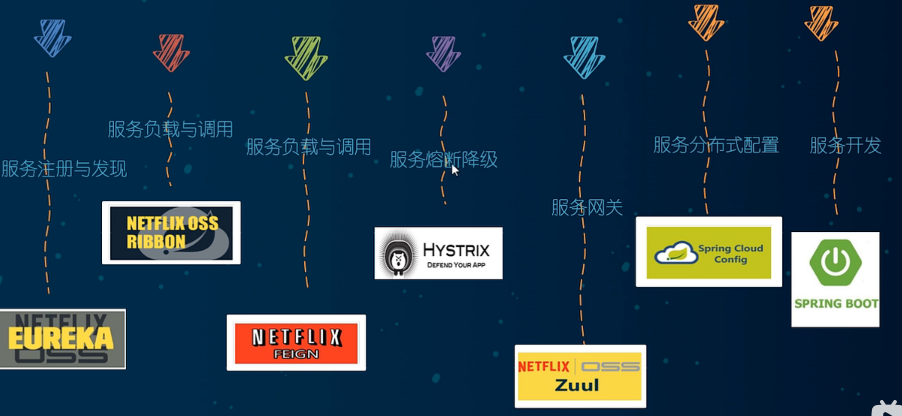

# 理论基础

**什么是微服务：**

- 微服务是一种架构风格
- 一个应用拆分为一组小型服务
- 每个服务运行在自己的进程内，也就是可独立部署和升级
- 服务围绕业务功能拆分
- 可以由全自动部署机制独立部署
- 去中心化，服务自治。服务可以使用不同的语言、不同的存储技术

**分布式微服务架构落地维度：**

- 服务调用

- 服务降级
- 服务注册与发先
- 服务熔断
- 负载均衡
- 服务消息队列
- 服务网关
- 配置中心管理
- 自动化构建部署
- 服务监控
- 全链路追踪
- 服务定时任务
- 调度操作

**什么是 Spring Cloud**

Spring Cloud是分布式微服务架构的站式解决方案，是多种微服务架构落地技术的集合体，俗称微服务全家桶

**Springboot 和 SpringCloud 版本依赖**

可以在 [Spring Cloud](https://spring.io/projects/spring-cloud) 官网上查看cloud与boot的对应版本

详细对应版本查看：

https://start.spring.io/actuator/info

在线json处理工具：[json工具 - 在线工具 (tool.lu)](https://tool.lu/json)

开发版本组件：

- Cloud - Hoxton.SR1
- Boot - 2.2.2.RELEASE
- Cloud Alibaba - 2.1.0.RELEASE
- Java - Java 8
- Maven - 3.5及以上
- MySQL - 5.7及以上

**Cloud组件停更说明：**

- 服务注册中心：
  - Eureka（停更不停用
  - Zookeeper （老技术的企业替换
  - Consul （go
  - Nacos （完美替换 ！！！
- 服务调用
  - Ribbon （正在转向LoadBalancer
  - LoadBalancer （萌芽期
- 服务调用2
  - Feign（已过时 ×
  - OpenFeign 
- 服务降级
  - Hystrix （官网停用但国内正大量使用
  - resilience for java （国外推荐
  - sentienl （国内推荐
- 服务网关
  - Zuul
  - gateway （主流！！
- 服务配置
  - Config （×
  - Nacos 
- 服务总线
  - Bus （×
  - Nacos 

**文档：**

Coud官方文档：https://cloud.spring.io/spring-cloud-static/Hoxton.SR1/reference/htmlsingle/

Coud中文文档：https://www.bookstack.cn/read/spring-cloud-docs/docs-index.md

Boot官方文档：https://docs.spring.io/spring-boot/docs/2.2.2.RELEASE/reference/htmlsingle/

# 工程构建

## 父工程

- New Project - maven工程 - create from archetype: maven-archetype-site
- 聚合总父工程名字
- Maven选版本
- 工程名字
- 字符编码 - Settings - File encoding
- 注解生效激活 - Settings - Annotation Processors
- Java编译版本选8
- File Type过滤 - Settings - File Type
  

**父工程pom文件：版本控制**

~~~java
<?xml version="1.0" encoding="UTF-8"?>
<project xmlns="http://maven.apache.org/POM/4.0.0"
         xmlns:xsi="http://www.w3.org/2001/XMLSchema-instance"
         xsi:schemaLocation="http://maven.apache.org/POM/4.0.0 http://maven.apache.org/xsd/maven-4.0.0.xsd">
    <modelVersion>4.0.0</modelVersion>

    <groupId>com.std</groupId>
    <artifactId>cloud01</artifactId>
    <version>1.0-SNAPSHOT</version>
    <packaging>pom</packaging>

    <!-- 统一管理jar包版本 -->
    <properties>
        <project.build.sourceEncoding>UTF-8</project.build.sourceEncoding>
        <maven.compiler.source>1.8</maven.compiler.source>
        <maven.compiler.target>1.8</maven.compiler.target>
        <junit.version>4.12</junit.version>
        <log4j.version>1.2.17</log4j.version>
        <lombok.version>1.16.18</lombok.version>
        <mysql.version>5.1.47</mysql.version>
        <druid.version>1.1.16</druid.version>
        <mybatis.spring.boot.version>1.3.0</mybatis.spring.boot.version>
    </properties>

    <!-- 子模块继承之后，提供作用： 锁定版本+子modlue不用写groupId和version -->
<!--   dependencyManagement 标签能让所有在子项目中引用一个依赖而不用显示的列出版本号 ， maven会沿着 父子层次向上走
    直到找到一个拥有 dependencyManagement 元素的项目，然后它就会使用这个 dependencyManagement 元素指定版本号-->
             
    <dependencyManagement>
        <dependencies>
            <!--spring boot 2.2.2-->
            <dependency>
                <groupId>org.springframework.boot</groupId>
                <artifactId>spring-boot-dependencies</artifactId>
                <version>2.2.2.RELEASE</version>
                <type>pom</type>
                <scope>import</scope>
            </dependency>
            <!--spring cloud Hoxton.SR1-->
            <dependency>
                <groupId>org.springframework.cloud</groupId>
                <artifactId>spring-cloud-dependencies</artifactId>
                <version>Hoxton.SR1</version>
                <type>pom</type>
                <scope>import</scope>
            </dependency>
            <!--spring cloud alibaba 2.1.0.RELEASE-->
            <dependency>
                <groupId>com.alibaba.cloud</groupId>
                <artifactId>spring-cloud-alibaba-dependencies</artifactId>
                <version>2.1.0.RELEASE</version>
                <type>pom</type>
                <scope>import</scope>
            </dependency>
            <dependency>
                <groupId>mysql</groupId>
                <artifactId>mysql-connector-java</artifactId>
                <version>${mysql.version}</version>
            </dependency>
            <dependency>
                <groupId>com.alibaba</groupId>
                <artifactId>druid</artifactId>
                <version>${druid.version}</version>
            </dependency>
            <dependency>
                <groupId>org.mybatis.spring.boot</groupId>
                <artifactId>mybatis-spring-boot-starter</artifactId>
                <version>${mybatis.spring.boot.version}</version>
            </dependency>
            <dependency>
                <groupId>junit</groupId>
                <artifactId>junit</artifactId>
                <version>${junit.version}</version>
            </dependency>
            <dependency>
                <groupId>log4j</groupId>
                <artifactId>log4j</artifactId>
                <version>${log4j.version}</version>
            </dependency>
            <dependency>
                <groupId>org.projectlombok</groupId>
                <artifactId>lombok</artifactId>
                <version>${lombok.version}</version>
                <optional>true</optional>
            </dependency>
        </dependencies>
    </dependencyManagement>

    <build>
        <plugins>
            <plugin>
                <groupId>org.springframework.boot</groupId>
                <artifactId>spring-boot-maven-plugin</artifactId>
                <version>2.2.6.RELEASE</version>
                <configuration>
                    <fork>true</fork>
                    <addResources>true</addResources>
                </configuration>
            </plugin>
        </plugins>
    </build>

</project>
~~~

**DependencyManagement和Dependencies**

- Maven使用 dependencyManagement 元素来提供了一种管理依赖版本号的方式。通常会在一个组织或者项目的最顶层的父POM中看到dependencyManagement元素。

- 使用 pom.xml 中的 dependencyManagement 元素能让所有在子项目中引用个依赖而不用显式的列出版本量。Maven会沿着父子层次向上走，直到找到一个拥有dependencyManagement元素的项目，然后使用.dependencyManagement元素中指定的版本号。

- 子模块继承之后，提供作用：锁定版本+子modlue不用写groupId和version

- 如果有多个子项目都引用同一样依赖，则可以避免在每个使用的子项目里都声明一个版本号，这样当想升级或切换到另一个版本时，只需要在顶层父容器里更新，而不需要一个一个子项目的修改；另外如果某个子项目需要另外的一个版本，只需要声明version就可。

- dependencyManagement 里只是声明依赖，并不实现引入，因此**子项目需要显示的声明需要用的依赖。**

- 如果不在子项目中声明依赖，是不会从父项目中继承下来的；只有在子项目中写了该依赖项,并且没有指定具体版本，才会从父项目中继承该项，并且version和scope都读取自父pom。

  

## 支付模块构建

**创建微服务模块：**

- 建Module
- 改POM
- 写YML
- 主启动
- 业务类

​														客户端消费者80：order ---->

​																								<----- 微服务提供者8001：payment

**创建cloud-provider-payment8001微服务提供者支付Module模块：**

**1：建8001的Maven工程(建Module）**：

**2：改pom**：

~~~java

    <dependencies>
        <!--包含了sleuth+zipkin-->
<!--        <dependency>-->
<!--            <groupId>org.springframework.cloud</groupId>-->
<!--            <artifactId>spring-cloud-starter-zipkin</artifactId>-->
<!--        </dependency>-->
        <!--eureka-client-->
<!--        <dependency>-->
<!--            <groupId>org.springframework.cloud</groupId>-->
<!--            <artifactId>spring-cloud-starter-netflix-eureka-client</artifactId>-->
<!--        </dependency>-->
        <!-- 引入自己定义的api通用包，可以使用Payment支付Entity -->
        <!--
        <dependency>
            <groupId>com.atguigu.springcloud</groupId>
            <artifactId>cloud-api-commons</artifactId>
            <version>${project.version}</version>
        </dependency>
        -->
        <dependency>
            <groupId>org.springframework.boot</groupId>
            <artifactId>spring-boot-starter-web</artifactId>
        </dependency>
        <dependency>
            <groupId>org.springframework.boot</groupId>
            <artifactId>spring-boot-starter-actuator</artifactId>
        </dependency>
        <dependency>
            <groupId>org.mybatis.spring.boot</groupId>
            <artifactId>mybatis-spring-boot-starter</artifactId>
        </dependency>
        <dependency>
            <groupId>com.alibaba</groupId>
            <artifactId>druid-spring-boot-starter</artifactId>
            <version>1.1.10</version>
        </dependency>
        <!--mysql-connector-java-->
        <dependency>
            <groupId>mysql</groupId>
            <artifactId>mysql-connector-java</artifactId>
        </dependency>
        <!--jdbc-->
        <dependency>
            <groupId>org.springframework.boot</groupId>
            <artifactId>spring-boot-starter-jdbc</artifactId>
        </dependency>
        <dependency>
            <groupId>org.springframework.boot</groupId>
            <artifactId>spring-boot-devtools</artifactId>
            <scope>runtime</scope>
            <optional>true</optional>
        </dependency>
        <dependency>
            <groupId>org.projectlombok</groupId>
            <artifactId>lombok</artifactId>
            <optional>true</optional>
        </dependency>
        <dependency>
            <groupId>org.springframework.boot</groupId>
            <artifactId>spring-boot-starter-test</artifactId>
            <scope>test</scope>
        </dependency>
    </dependencies>
~~~

- 要先注释掉 sleuth+zipkin 包，否则会报：Cannot execute request on any known server ：连接 Eurek 服务端地址不对

**3：写YML**：

~~~java
server:
  port: 8001  # 端口号

spring:
  application:
    name: payment     # 微服务名称
  datasource:
    type: com.alibaba.druid.pool.DruidDataSource           # 当前数据源操作类型
    driver-class-name: com.mysql.jdbc.Driver             # mysql驱动包
    url: jdbc:mysql://localhost:3306/cloud?useUnicode=true&characterEncoding=utf-8&useSSL=false
    username: root
    password: 123456

mybatis:
  mapper-locations: classpath:mapper/*.xml       # mybatis 映射
  type-aliases-package: com.cloud.pay.entry    # 所有Entity别名类所在包

#eureka:
#  client:
#    registerWithEureka: false
#    fetchRegistry: false

~~~

**4: 主启动**

~~~java
@SpringBootApplication
public class PaymentMain8001 {
    public static void main(String[] args) {
        SpringApplication.run(PaymentMain8001.class,args) ;
    }
}
~~~

**5：业务类**

- sql

~~~sql
// sql：
CREATE TABLE `payment`(
	`id` bigint(20) NOT NULL AUTO_INCREMENT COMMENT 'ID',
    `serial` varchar(200) DEFAULT '',
	PRIMARY KEY (id)
)ENGINE=InnoDB AUTO_INCREMENT=1 DEFAULT CHARSET=utf8mb4
~~~

- 实体类

~~~java
//Entities：
// 实体类Payment：
@Data
@AllArgsConstructor
@NoArgsConstructor
public class Payment implements Serializable {
    private Long id;
    private String serial;
}
~~~

- Result 结果封装

~~~java
//JSON封装Result：
/**
 * 通用返回结果，服务端响应的数据最终都会封装成此对象
 * @param <T>
 */
@Data
public class Result<T> {

    private Integer code; //编码：1成功，0和其它数字为失败

    private String msg; //错误信息

    private T data; //数据

    private Map map = new HashMap(); //动态数据

    public static <T> Result<T> success(T object) {
        R<T> r = new R<T>();
        r.data = object;
        r.code = 1;
        return r;
    }

    public static <T> Result<T> error(String msg) {
        R r = new R();
        r.msg = msg;
        r.code = 0;
        return r;
    }

    public Result<T> add(String key, Object value) {
        this.map.put(key, value);
        return this;
    }

}

~~~

- Dao接口

~~~java
// PaymentDao 接口
@Mapper
//@Repository不用Spring的
public interface PaymentDao
{
    public int create(Payment payment);

    public Payment getPaymentById(@Param("id") Long id);
}

~~~

-  MyBatis映射文件

~~~xml
<?xml version="1.0" encoding="UTF-8" ?>
<!DOCTYPE mapper PUBLIC "-//mybatis.org//DTD Mapper 3.0//EN" "http://mybatis.org/dtd/mybatis-3-mapper.dtd" >

<!-- dao接口映射路径-->
<mapper namespace="com.cloud.pay.Dao.PaymentDao">

<!--    id: 对应mapper接口中的方法   ;  parameterType 对应实体类 ; -->
<!--    数据库表中外键关系存在时 useGeneratedKeys="true" keyProperty="id" 不能使用-->
<insert id="create" parameterType="Payment" useGeneratedKeys="true" keyProperty="id">
    insert into payment(serial)  values(#{serial});
</insert>
<!--    建立实体类与表中字段的映射-->
<resultMap id="BaseResultMap" type="com.cloud.pay.entry.Payment">
    <id column="id" property="id" jdbcType="BIGINT"/>
    <id column="serial" property="serial" jdbcType="VARCHAR"/>
</resultMap>

<select id="getPaymentById" parameterType="Long" resultMap="BaseResultMap" >
    select * from payment where id=#{id};
</select>

</mapper>
~~~

- useGeneratedKeys 设置为"true"表明要 MyBatis 获取由数据库自动生成的主键；
- keyproperty=主键,指定把获取到的主键值注入到 XXX（实体类） 对应的 主键 属性。
- useGeneratedKeys =true，keyProperty="id" ，以解决在主键自增的情况下获取主键
- keyColumn：如果实体类属性和表字段不一一对应时，可以实现数据库与实体类的映射
- 以上三个参数都只在 inser 语句中存在

- Service

~~~java
// 接口PaymentService

public interface PaymentService
{
    public int create(Payment payment);

    public Payment getPaymentById(@Param("id") Long id);
}

//实现类
@Service
public class PaymentServiceImpl implements PaymentService
{
    @Resource
    private PaymentDao paymentDao;

    public int create(Payment payment)
    {
        return paymentDao.create(payment);
    }

    public Payment getPaymentById(Long id)
    {
        return paymentDao.getPaymentById(id);
    }
}
~~~

- Controller

~~~java
@RestController
@Slf4j
public class PaymentController{
    @Resource
    private PaymentService paymentService;

    @PostMapping(value = "/payment/create")
    public CommonResult create(Payment payment)
    {
        int result = paymentService.create(payment);
        log.info("*****插入结果："+result);

        if(result > 0)
        {
            return new CommonResult(200,"插入数据库成功,serverPort: "+serverPort,result);
        }else{
            return new CommonResult(444,"插入数据库失败",null);
        }
    }

    @GetMapping(value = "/payment/get/{id}")
    public CommonResult<Payment> getPaymentById(@PathVariable("id") Long id)
    {
        Payment payment = paymentService.getPaymentById(id);

        if(payment != null)
        {
            return new CommonResult(200,"查询成功,serverPort:  "+serverPort,payment);
        }else{
            return new CommonResult(444,"没有对应记录,查询ID: "+id,null);
        }
    }
}
~~~

**各种报错：**

- Cannot execute request on any known server ：连接 Eurek 服务端地址不对。当在启动 spring cloud 微服务 provider 时，在默认设置下，eureka 服务注册中心也会将自己作为客户端来尝试注册它自己，所以我们需要禁用它的客户端注册。
  配置如下：

  - 解决：更改.yml文件或者.properties文件配置

  ~~~yaml
  eureka.client.registerWithEureka=false   #是否将自己注册到 Eureka-Server 中，默认的为 true   registerWithEureka等同于register_with_eureka
  eureka.client.fetchRegistry=false        #是否需要拉取服务信息，默认未true       fetchRegistry等同于 fetch-registry
  
  # 或者
  eureka:
   client:
    registerWithEureka: false
    fetchRegistry: false
  ~~~

-  java.net.ConnectException: Connection refused: connect：端口号被占用：杀死占用端口号的进程，释放端口；彻底关闭 Tomcat 服务器，或者重新启动项目。

~~~
netstat -ano #查看所有
netstat -ano |findstr 端口号
taskkill -pid pid -f
~~~

## 热部署devtools

开发时使用，生产环境关闭

导包

~~~java
<dependency>
    <groupId>org.springframework.boot</groupId>
    <artifactId>spring-boot-devtools</artifactId>
    <scope>runtime</scope>
    <optional>true</optional>
</dependency>
~~~

聚合父类总工程的pom.xml配置

~~~java
<build>
    <!--
	<finalName>你的工程名</finalName>（单一工程时添加）
    -->
    <plugins>
        <plugin>
            <groupId>org.springframework.boot</groupId>
            <artifactId>spring-boot-maven-plugin</artifactId>
            <configuration>
                <fork>true</fork>
                <addResources>true</addResources>
            </configuration>
        </plugin>
    </plugins>
</build>

~~~

开启自动构建

File -> Settings(New Project Settings->Settings for New Projects) ->Complier

勾选：

- Automatically show first error in editor
- Display notification on build completion
- Build project automatically
- Compile independent modules in parallel

File -> Settings-->advanced setting ->complier: 勾选第一个(allow auto-make to star....)

更新的值

Ctrl + Shift + Alt + / ，打开Registry，勾选：

- actionSystem.assertFocusAccessFromEdt

编辑application启动配置：

修改选修->执行更新时的操作：更新类和资源

重启ieda

## 消费者订单模块

建 model：cloud-consumer-order80

该pom：

~~~java
<dependencies>
    <dependency>
      <groupId>org.springframework.boot</groupId>
      <artifactId>spring-boot-starter-web</artifactId>
    </dependency>
    <dependency>
      <groupId>org.springframework.boot</groupId>
      <artifactId>spring-boot-starter-actuator</artifactId>
    </dependency>

    <dependency>
      <groupId>org.springframework.boot</groupId>
      <artifactId>spring-boot-devtools</artifactId>
      <scope>runtime</scope>
      <optional>true</optional>
    </dependency>
    <dependency>
      <groupId>org.projectlombok</groupId>
      <artifactId>lombok</artifactId>
      <optional>true</optional>
    </dependency>
    <dependency>
      <groupId>org.springframework.boot</groupId>
      <artifactId>spring-boot-starter-test</artifactId>
      <scope>test</scope>
    </dependency>
  </dependencies>
~~~

